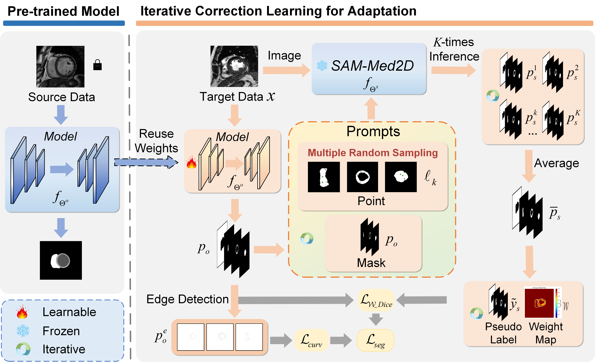

## IPLC & IPLC+
This is the official pytorch implementation of our MICCAI 2024 paper "IPLC: Iterative Pseudo Label Correction Guided by SAM for Source-Free Domain Adaptation in Medical Image Segmentation" and extended journal version "IPLC+: SAM-Guided Iterative Pseudo Label Correction for Source-Free Domain Adaptation in Medical Image Segmentation".

## To do
- [ ] IPLC+ code and weights
- [x] IPLC pre-training code and weights
 (MICCAI 2024 early accept)


## 👉 Requirements
Non-exhaustive list:
* python3.9+
* Pytorch 1.10.1
* nibabel
* Scipy
* NumPy
* Scikit-image
* yaml
* tqdm
* pandas
* scikit-image
* SimpleITK


## 👉 Usage
1. Download the [M&MS Dataset](http://www.ub.edu/mnms), and organize the dataset directory structure as follows:
```
your/data_root/
       train/
            img/
                A/
                    A0S9V9_0.nii.gz
                    ...
                B/
                C/
                ...
            lab/
                A/
                    A0S9V9_0_gt.nii.gz
                    ...
                B/
                C/
                ...
       valid/
            img/
            lab/
       test/
           img/
           lab/
```
The network takes nii files as an input. The gt folder contains gray-scale images of the ground-truth, where the gray-scale level is the number of the class (0,1,...K).

2. Download the [SAM-Med2D model](https://drive.google.com/file/d/1ARiB5RkSsWmAB_8mqWnwDF8ZKTtFwsjl/view?usp=drive_link) and move the model to the "your_root/pretrain_model" directory in your project.

3. Train the source model in the source domain, for instance, you can train the source model using domain A on the M&MS dataset:

```
python train_source.py --config "./config/train2d_source.cfg"
```

4. Adapt the source model to the target domain, for instance, you can adapt the source model to domain B on the M&MS dataset:

```
python adapt_main.py --config "./config/adapt.cfg"
```
## Citation
If you find this project useful for your research, please consider citing:

```bibtex
@inproceedings{zhang2024iplc,
  title={IPLC: iterative pseudo label correction guided by SAM for source-free domain adaptation in medical image segmentation},
  author={Zhang, Guoning and Qi, Xiaoran and Yan, Bo and Wang, Guotai},
  booktitle={International Conference on Medical Image Computing and Computer-Assisted Intervention},
  pages={351--360},
  year={2024},
  organization={Springer}
}
``` 
## 🤝 Acknowledgement
- Thanks to the open-source of the following projects: [Segment Anything](https://github.com/facebookresearch/segment-anything); [SAM-Med2D](https://github.com/cv-chaitali/SAM-Med2D)
